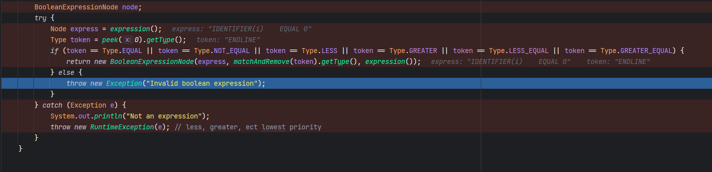

----------------------------------------------------------------------------------

eg. Write will take a collection of `InterpreterDataType` objects and print them to the screen.
Use the collection of `InterpreterDataType` to get parameters and to output to variable parameters.

 [ ] Make sure that you check the data types of the `InterpreterDataTypes`.
 [ ] Throw exceptions if the functions are called incorrectly.

--------------------------------

#7

1. [ ]  Finally, we will call a function called “**InterpretBlock**” - this function will process all of the
   code between “begin” and “end”; we will use it later for conditionals and loops.

2. [ ] **InterpretBlock** should take the collection of statements and a hashmap of variables. We will loop
   over the collection of statements.

3. [ ] For now, the only statement type that we will handle is function calls.

4. [ ] If the statement is a function call, implement the process described in the background section,
   otherwise we will ignore the statement (for now).

-------------------------------------------------------------

#8

1. [ ] Start with adding assignment statements. In “InterpretBlock” we need to look at the type of AST node that we are
   running. We previously only worked on FunctionCallNodes. Now we will extend that to AssignmentNode.

2. [ ] Remember that an assignment has an expression and a target. The target is a variable and is, therefore, in our
   hash map of variables. Look it up and find its data type (int or float). That will tell you how to resolve the
   expression.

-------------------------------------------------------------

#9

1. [ ] Change Factor() to return a BoolNode when it finds the true and false tokens.

2. [ ]  Then merge in from your existing code the boolean operators ( less than, less than or equal, etc) to *
   *ExpressionRightHandSide**.
   Remember that we can’t chain booleans like we do addition and subtraction; ExpressionRightHandSidethat is to say
   2+3+4 is allowed, but 4>x>9 is not allowed.

3. [ ] Instead, I created a “**CharContents**” and “**StringContents**”. Note that one thing that we need to do is
   enforce the length limit of 1 character on CharContents.

4. [ ] CharNode and a StringNode for those data types. Add those to Factor() as well.

------------------------------

1. [ ] Create a new class called SemanticAnalysis. Add a method called “**CheckAssignments**”. We will pass our
   collection of functions to this method. For each function, we need to look at every assignment statement (remember
   that they could be in sub-blocks like inside an “if” hint - recursion).

2. [ ] Consider the variable on the left side of the assignment as the “correct” type. Make sure that everything on the
   right side of the assignment is the same type. If it is not, throw an exception. Add as much information as you can
   to help the user debug this.

Remember that string + character and character + string are allowable (both create a string).

It’s OK to assume that char and string are interchangeable for this check. 
Also remember that operands can be variables or constants. 
You may need to make several functions to implement this – I did. Call this method from “`main`” before you call
the `interpreter`

1. [ ] Implement the built-in functions for strings (refer to the Language Definition document).

2. [ ] Create `ResolveBoolean`, `ResolveString` and `ResolveCharacter` similar to how we implemented ResolveInteger and
   ResolveFloat. Implement the operator + for string/string, character/string and string/character. Use ResolveBoolean
   for if, while and repeat statements. This will allow us to use variables for conditions

3. [ ] Add string, boolean and character types to function calls.

---------------------------------

Current issue. I'm cycling back through after creating a booleanNode, looking for more. so I create the node but don't
ever send it back
in Parser -> BooleanExpression 

